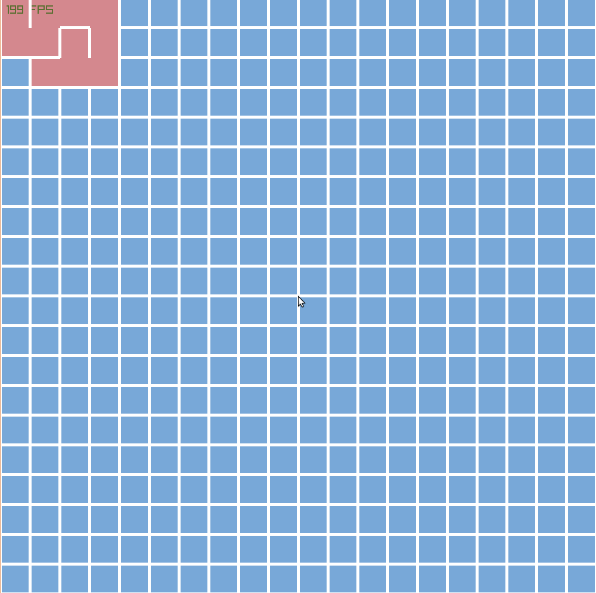
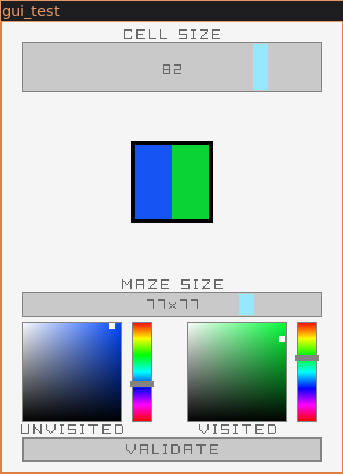

# Maze Generating


## Algorithm
This is an implementation of Randomized depth-first search algorithm.
It creates a maze by taking a random valid path and comes back when it can't continue. It goes back until it can go at an other random valid cell. This process is called backtracking.

## Demo
To run it, you'll need the Raylib library installed. [HOW TO](https://github.com/raysan5/raylib/wiki/Working-on-GNU-Linux)

Just run ```make run``` command to build and launch the programm.

### Random maze generated


## Todo
1. Solve the maze.
2. Add highlightning to the current cell.
3. Add gui to chose the size and colors 


## Sources
[Wikipedia](https://en.wikipedia.org/wiki/Maze_generation_algorithm)
[Video - Coding Train](https://www.youtube.com/watch?v=HyK_Q5rrcr4)
[Raylib - Graphics Library](www.raylib.com)